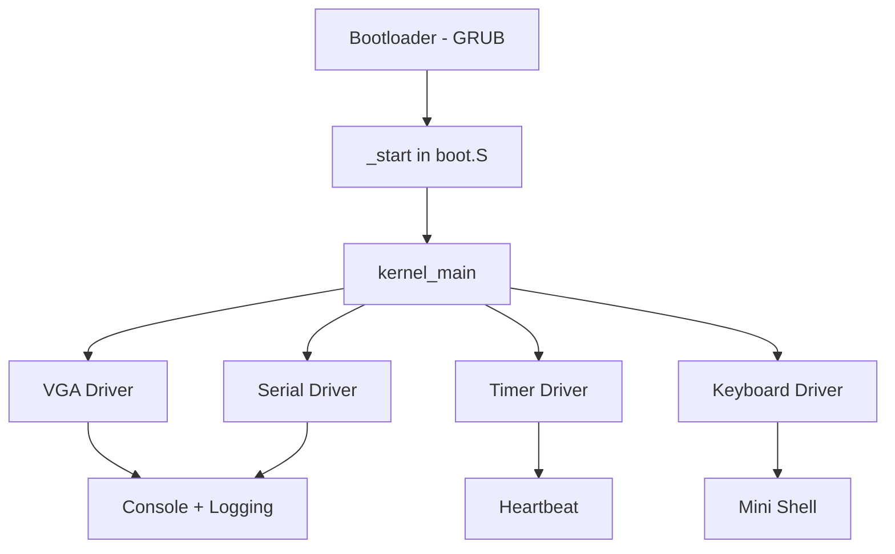
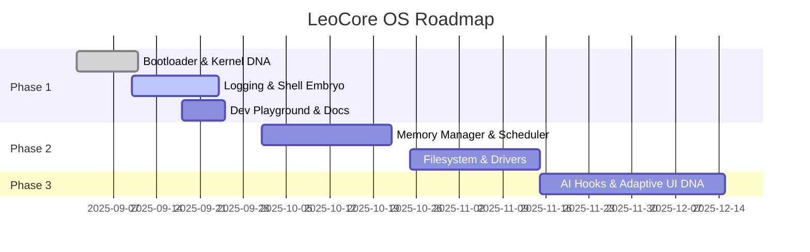

# LeoCore OS

> **“Not just another kernel. A seed of the future.”**

LeoCore OS is a **next-generation AI-native operating system**, designed from scratch to be **modular, adaptive, and alive**.
Where Linux, Windows, and macOS evolved for the last century of computing, **LeoCore is born for the next**:
brain-computer interfaces, holographic workspaces, quantum-inspired computation, and AI that coexists at the kernel level.

We are building **the embryo of a living OS**. Phase 1 is small, but iconic — and it already carries the DNA of the future.

---

## Vision

* **AI-Native Core** — AI hooks live inside the kernel, not bolted on as assistants.
* **Universal Compatibility** — containerized apps, WASM 2.0, holographic formats.
* **Adaptive Input** — keyboard, voice, gesture, AR/VR, BCI.
* **Self-Healing Kernel** — error prediction + recovery, not blue screens.
* **Future Connectivity** — mesh networks, edge compute, 7G-ready.

---

## Phase 1: The Embryo OS

Even as a “hello world” kernel, Phase 1 carries **signature traits**:

* Boot banner with **ASCII art + CPU/RAM detection**
* Colored VGA logging system (`INFO`, `WARN`, `ERROR`)
* **Heartbeat timer** ticking every second → the OS is alive
* **Mini-shell** with built-in commands (`help`, `about`, `clear`, `panic`)
* Serial logging for developers
* GRUB-compatible multiboot loader + clean linker script
* Sandbox playground: `ai_assist.c` and `quantum_stub.c` (for fun + future dreams)

---

## Architecture (Phase 1)



---

## Repository Structure

```plaintext
core/
 ├── bootloader/   # Multiboot header, GRUB config
 ├── kernel/       # main, panic, heartbeat, shell
 ├── drivers/      # vga, keyboard, serial, timer
 ├── include/      # headers for modular kernel
 └── linker.ld
scripts/           # build, run, debug, clean
docs/              # phase1.md, testing.md, design.md
for_betterment/    # AI + quantum playground stubs
Makefile
```

---

## Technology Stack

* **C + Assembly** — minimal, clean, no bloat.
* **GRUB Multiboot** — future-proof boot process.
* **QEMU / GDB** — for emulation + debugging.
* **Cross-Compiler Toolchain** — portable builds across dev systems.

---

## Why LeoCore Beats the Rest

| Feature                      | LeoCore OS | Linux   | Windows | macOS   |
| ---------------------------- | ---------- | ------- | ------- | ------- |
| AI-integrated kernel         | ✅          | ❌       | Partial | Partial |
| Future input modes           | ✅          | ❌       | ❌       | ❌       |
| Self-healing kernel          | ✅          | ❌       | ❌       | ❌       |
| Universal app DNA            | ✅          | Partial | ❌       | ❌       |
| Adaptive UI/UX roots         | ✅          | ❌       | ❌       | Partial |
| Privacy-first, decentralized | ✅          | Partial | ❌       | ❌       |

---

## Roadmap



---

## ⚡ Getting Started

```bash
# Build ISO
make build

# Run in QEMU
make run

# Debug with GDB
make debug
```

If `x86_64-elf-gcc` is missing, the build system gracefully falls back to host `gcc`.

---

## Future-Proof by Design

Most operating systems are locked into the assumptions of their time.
LeoCore OS is built differently — as a **living core** that evolves with every new leap in technology.

* **Connectivity Agnostic** → From today’s 5G, to 7G, to mesh networks, to yet-unnamed protocols, LeoCore adapts. The networking layer is modular and AI-optimized.
* **Input Infinite** → Whether you type, speak, gesture, project into AR/VR, or think through a BCI, LeoCore integrates input as modules — not hacks.
* **App Universality** → Linux binaries, Windows compatibility, WASM 2.0, holographic formats, and future app standards are first-class citizens.
* **AI-Native Evolution** → The kernel itself has hooks for AI-driven optimization and self-healing, making it smarter as models and accelerators advance.
* **Post-Silicon Ready** → Whether silicon, quantum, neuromorphic, or hybrid chips dominate the future, LeoCore’s modular drivers + scheduler are designed to plug in.


---
# **LeoCore OS isn’t chasing the future. It’s built to live there.**

